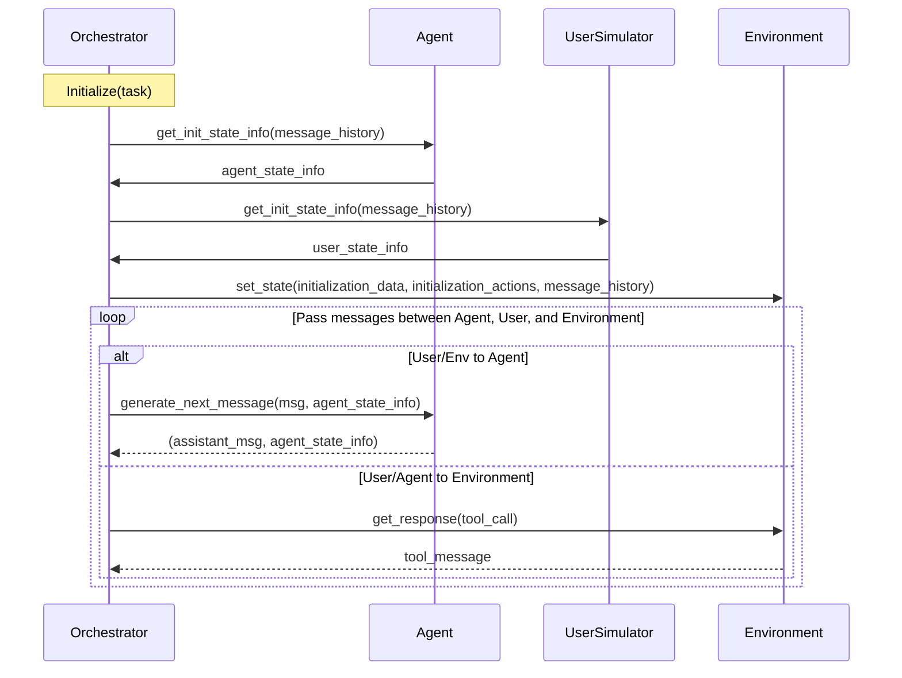

# Tool Calling in tau2-bench: Complete Developer Guide

This document explains how tool calling works in tau2-bench and how to create your own agent implementation.

## Table of Contents
1. [Architecture Overview](#architecture-overview)
2. [Core Components](#core-components)
3. [Tool System](#tool-system)
4. [Agent Implementation](#agent-implementation)
5. [Message Flow](#message-flow)
6. [Creating Your Own Agent](#creating-your-own-agent)
7. [Examples](#examples)

## Architecture Overview

tau2-bench implements a dual-control environment where agents interact with users and tools to complete tasks. The orchestration sequence follows this pattern:



## Core Components

### 1. Tools (`src/tau2/environment/tool.py`)

Tools are Python functions wrapped with OpenAI-compatible schemas. They are created using:

```python
class Tool(BaseTool):
    """Tool built from a Python function, can be called by LLMs."""
    
    def __init__(self, func: Callable, use_short_desc: bool = False, **predefined: Any):
        # Automatically parses function signature, docstring, and type hints
        # Creates OpenAI-compatible schema
```

Key features:
- **Automatic Schema Generation**: Converts Python functions to OpenAI tool schemas
- **Type Safety**: Uses Pydantic models for parameters and returns
- **Documentation**: Extracts docstrings for tool descriptions

### 2. Messages (`src/tau2/data_model/message.py`)

The message system supports structured conversation with tool calls:

```python
class AssistantMessage(ParticipantMessageBase):
    """Message from assistant that can contain tool calls."""
    role: AssistantRole = "assistant"
    content: Optional[str] = None
    tool_calls: Optional[list[ToolCall]] = None

class ToolCall(BaseModel):
    """Represents a tool call."""
    id: str
    name: str
    arguments: dict
    requestor: ToolRequestor = "assistant"

class ToolMessage(BaseModel):
    """Response from a tool execution."""
    id: str
    role: ToolRole = "tool"
    content: Optional[str] = None
    requestor: Literal["user", "assistant"] = "assistant"
    error: bool = False
```

### 3. Agent Base (`src/tau2/agent/base.py`)

All agents inherit from `BaseAgent` and implement:

```python
class BaseAgent(ABC, Generic[AgentState]):
    @abstractmethod
    def generate_next_message(
        self, message: ValidAgentInputMessage, state: AgentState
    ) -> tuple[AssistantMessage, AgentState]:
        """Generate response to user/tool message."""
        pass

    @abstractmethod
    def get_init_state(
        self, message_history: Optional[list[Message]] = None
    ) -> AgentState:
        """Initialize agent state."""
        pass
```

## Tool System

### Tool Definition Pattern

Tools are defined in domain-specific toolkits that inherit from `ToolKitBase`:

```python
from tau2.environment.toolkit import ToolKitBase, ToolType, is_tool

class AirlineTools(ToolKitBase):
    db: AirlineDB
    
    @is_tool(ToolType.READ)
    def search_direct_flight(self, origin: str, destination: str, date: str) -> list[DirectFlight]:
        """Search for direct flights between two cities on a specific date.
        
        Args:
            origin: The origin city code (e.g., 'SFO')
            destination: The destination city code (e.g., 'LAX') 
            date: The departure date in YYYY-MM-DD format
            
        Returns:
            List of available direct flights
        """
        return self.db.search_flights(origin, destination, date)
    
    @is_tool(ToolType.WRITE)
    def book_reservation(self, user_id: str, flight_id: str) -> Reservation:
        """Book a flight reservation for a user.
        
        Args:
            user_id: The ID of the user making the reservation
            flight_id: The ID of the flight to book
            
        Returns:
            The created reservation object
        """
        return self.db.create_reservation(user_id, flight_id)
```

### Tool Types

- **`ToolType.READ`**: Read-only operations (searches, queries)
- **`ToolType.WRITE`**: State-modifying operations (bookings, updates)
- **`ToolType.THINK`**: Reasoning tools (calculations, analysis)
- **`ToolType.GENERIC`**: General purpose tools

### Tool Registration

The `@is_tool()` decorator automatically:
1. Registers the method as a tool
2. Extracts function signature and docstring
3. Generates OpenAI-compatible schema
4. Handles type conversion

## Agent Implementation

### 1. LLM Agent (`src/tau2/agent/llm_agent.py`)

The standard LLM agent uses LiteLLM for tool calling:

```python
class LLMAgent(LocalAgent[LLMAgentState]):
    def generate_next_message(
        self, message: ValidAgentInputMessage, state: LLMAgentState
    ) -> tuple[AssistantMessage, LLMAgentState]:
        # Update message history
        state.messages.append(message)
        
        # Generate response using LLM with tools
        assistant_message = generate(
            model=self.llm,
            tools=self.tools,  # Converted to OpenAI schema
            messages=state.system_messages + state.messages,
            **self.llm_args,
        )
        
        state.messages.append(assistant_message)
        return assistant_message, state
```

### 2. LLM Utils (`src/tau2/utils/llm_utils.py`)

The `generate()` function handles:
- Converting tau2 messages to LiteLLM format
- Tool schema conversion
- LLM API calls
- Response parsing

```python
def generate(
    model: str,
    messages: list[Message],
    tools: Optional[list[Tool]] = None,
    tool_choice: Optional[str] = None,
    **kwargs: Any,
) -> AssistantMessage:
    # Convert tau2 messages to LiteLLM format
    litellm_messages = to_litellm_messages(messages)
    
    # Convert tools to OpenAI schema
    tools = [tool.openai_schema for tool in tools] if tools else None
    
    # Make LLM call
    response = completion(
        model=model,
        messages=litellm_messages,
        tools=tools,
        tool_choice=tool_choice,
        **kwargs,
    )
    
    # Parse tool calls from response
    tool_calls = [
        ToolCall(
            id=tc.id,
            name=tc.function.name,
            arguments=json.loads(tc.function.arguments),
        )
        for tc in response.choices[0].message.tool_calls or []
    ]
    
    return AssistantMessage(
        role="assistant",
        content=response.choices[0].message.content,
        tool_calls=tool_calls or None,
    )
```

## Message Flow

### 1. Tool Call Execution

When an agent makes a tool call:

1. **Agent generates `AssistantMessage`** with `tool_calls`
2. **Orchestrator sends to Environment** for execution
3. **Environment executes tools** and returns `ToolMessage`
4. **Tool results sent back to Agent** for next iteration

### 2. Conversation Loop

```python
# Simplified orchestration loop
while not done:
    if current_speaker == "agent":
        assistant_msg, agent_state = agent.generate_next_message(last_message, agent_state)
        
        if assistant_msg.is_tool_call():
            # Execute tools in environment
            tool_results = environment.execute_tools(assistant_msg.tool_calls)
            last_message = MultiToolMessage(tool_messages=tool_results)
            # Continue with agent
        else:
            # Agent responded to user
            last_message = assistant_msg
            current_speaker = "user"
    
    elif current_speaker == "user":
        user_msg, user_state = user.generate_next_message(last_message, user_state)
        last_message = user_msg
        current_speaker = "agent"
```

## Creating Your Own Agent

### Step 1: Define Agent Class

```python
from tau2.agent.base import LocalAgent, ValidAgentInputMessage
from tau2.data_model.message import AssistantMessage, Message
from typing import Optional, List
from pydantic import BaseModel

class MyAgentState(BaseModel):
    """Custom state for your agent."""
    conversation_history: list[Message] = []
    current_task: Optional[str] = None
    # Add any state you need

class MyCustomAgent(LocalAgent[MyAgentState]):
    def __init__(self, tools: List[Tool], domain_policy: str, **kwargs):
        super().__init__(tools, domain_policy)
        # Initialize your agent-specific components
        
    def get_init_state(
        self, message_history: Optional[list[Message]] = None
    ) -> MyAgentState:
        return MyAgentState(
            conversation_history=message_history or []
        )
    
    def generate_next_message(
        self, message: ValidAgentInputMessage, state: MyAgentState
    ) -> tuple[AssistantMessage, MyAgentState]:
        # Update state
        state.conversation_history.append(message)
        
        # Your agent logic here
        # - Analyze the message
        # - Decide whether to call tools or respond
        # - Generate appropriate response
        
        response = self._process_message(message, state)
        state.conversation_history.append(response)
        
        return response, state
    
    def _process_message(self, message, state) -> AssistantMessage:
        # Implement your agent logic
        # This could be:
        # - Rule-based reasoning
        # - Custom LLM integration
        # - ReAct-style reasoning
        # - Planning algorithms
        # - etc.
        
        if self._should_use_tool(message, state):
            # Create tool call
            tool_call = ToolCall(
                id="tool_1",
                name="search_flights",
                arguments={"origin": "SFO", "destination": "LAX"}
            )
            return AssistantMessage(
                role="assistant",
                content=None,
                tool_calls=[tool_call]
            )
        else:
            # Generate text response
            return AssistantMessage(
                role="assistant",
                content="I can help you with that...",
                tool_calls=None
            )
```

### Step 2: Register Your Agent

```python
# In src/tau2/registry.py
from tau2.agent.my_custom_agent import MyCustomAgent

# Add to registry initialization
registry.register_agent(MyCustomAgent, "my_custom_agent")
```

### Step 3: Use Your Agent

```bash
tau2 run \
  --domain airline \
  --agent my_custom_agent \
  --agent-llm gpt-4 \
  --user-llm gpt-4 \
  --num-trials 1 \
  --num-tasks 5
```

## Examples

### Example 1: Rule-Based Agent

```python
class RuleBasedAgent(LocalAgent[MyAgentState]):
    def _process_message(self, message, state) -> AssistantMessage:
        user_content = message.content.lower() if hasattr(message, 'content') else ""
        
        # Rule-based logic
        if "book" in user_content and "flight" in user_content:
            return self._handle_flight_booking(message, state)
        elif "search" in user_content:
            return self._handle_search(message, state)
        else:
            return AssistantMessage(
                role="assistant",
                content="I can help you book flights or search for options. What would you like to do?"
            )
    
    def _handle_flight_booking(self, message, state):
        # Extract booking details and create tool call
        tool_call = ToolCall(
            id="booking_1",
            name="book_reservation",
            arguments={"user_id": "user123", "flight_id": "FL456"}
        )
        return AssistantMessage(
            role="assistant", 
            tool_calls=[tool_call]
        )
```

### Example 2: Custom LLM Integration

```python
class CustomLLMAgent(LocalAgent[MyAgentState]):
    def __init__(self, tools, domain_policy, custom_llm_client):
        super().__init__(tools, domain_policy)
        self.llm_client = custom_llm_client
    
    def _process_message(self, message, state) -> AssistantMessage:
        # Format conversation for your LLM
        prompt = self._build_prompt(message, state)
        
        # Call your custom LLM
        response = self.llm_client.generate(
            prompt=prompt,
            tools=self._format_tools_for_llm(),
            max_tokens=1000
        )
        
        # Parse response and create AssistantMessage
        return self._parse_llm_response(response)
```

## Key Concepts

### Tool Execution Context
- Tools execute in the domain environment with access to domain database
- Tool results are automatically formatted as `ToolMessage` objects
- Agents receive tool results in the next iteration

### State Management
- Agents maintain conversation state between turns
- State can include conversation history, task context, reasoning traces
- State is passed between `generate_next_message` calls

### Error Handling
- Tool execution errors are captured in `ToolMessage.error`
- Agents should handle tool failures gracefully
- Framework provides retry mechanisms and error recovery

### Performance Considerations
- Tools are executed synchronously
- Multiple tool calls in one message are executed in sequence
- Consider tool execution time when designing agent strategies

This guide provides the foundation for understanding and implementing tool-calling agents in tau2-bench. The framework is designed to be flexible while maintaining consistency across different agent implementations.